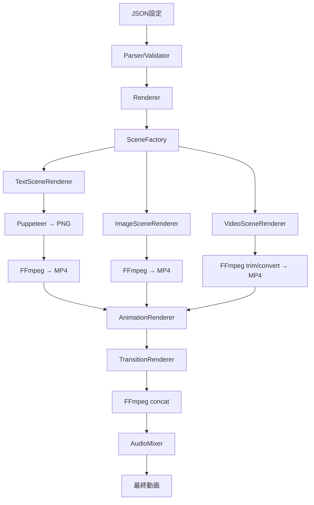

# Kumiki アーキテクチャ

## 概要

このドキュメントは、Kumikiのアーキテクチャをまとめたものです。

## アーキテクチャ方針

### 基本原則

1. **シーンベースアーキテクチャ**
   - フレームベースではなくシーン単位で動画生成
   - 各シーンは独立した動画として生成し、最後に結合

2. **責務の明確な分離**
   - 1つのクラス/モジュールは1つの責務のみを持つ
   - シーンタイプごとに専用のレンダラーを実装

3. **FFmpegの最大活用**
   - アニメーションやトランジションはFFmpegフィルターで実装
   - HTML/CSSレンダリングは最小限に抑える

4. **拡張性を重視**
   - 新しいシーンタイプやエフェクトの追加が容易
   - プラグイン形式での機能拡張を考慮

## プロジェクト構造

```
kumiki/
├── src/
│   ├── core/               # コア機能
│   │   ├── parser.ts      # JSON解析とバリデーション
│   │   ├── validator.ts   # 詳細な検証ロジック
│   │   ├── renderer.ts    # メインレンダリング制御
│   │   └── narrator.ts    # ナレーション生成（将来実装）
│   ├── scenes/            # シーンレンダラー
│   │   ├── base.ts        # 基底シーンクラス
│   │   ├── factory.ts     # シーンレンダラー生成
│   │   ├── text.ts        # テキストシーンレンダラー
│   │   ├── image.ts       # 画像シーンレンダラー
│   │   └── video.ts       # 動画シーンレンダラー
│   ├── effects/           # エフェクト処理
│   │   ├── animations.ts  # アニメーション効果
│   │   └── transitions.ts # トランジション効果
│   ├── services/          # 外部サービス連携
│   │   ├── ffmpeg.ts      # FFmpegラッパー
│   │   ├── puppeteer.ts   # Puppeteerサービス
│   │   ├── gemini.ts      # Gemini API（将来実装）
│   │   └── audio.ts       # オーディオミキシング
│   ├── commands/          # CLIコマンド
│   │   ├── generate.ts    # 動画生成コマンド
│   │   ├── validate.ts    # 検証コマンド
│   │   └── preview.ts     # プレビューコマンド
│   ├── types/             # 型定義
│   │   └── index.ts       # 共通型定義
│   ├── utils/             # ユーティリティ
│   │   ├── logger.ts      # ログ出力
│   │   ├── errors.ts      # カスタムエラー
│   │   ├── progress.ts    # 進捗表示
│   │   └── assets.ts      # アセット管理
│   ├── cli.ts             # CLIエントリーポイント
│   └── index.ts           # プログラマティックAPI
├── tests/                 # テストファイル
├── docs/                  # ドキュメント
└── examples/              # サンプルプロジェクト
```

## JSON構造

```json
{
  "version": "1.0",
  "name": "プロジェクト名",
  "settings": {
    "resolution": "1920x1080",
    "fps": 30,
    "duration": null  // 自動計算
  },
  "scenes": [
    {
      "id": "scene-1",
      "type": "text",
      "duration": 3,
      "content": {
        "text": "Hello World",
        "style": {
          "fontSize": 48,
          "color": "#ffffff",
          "fontFamily": "Noto Sans JP",
          "fontWeight": "bold",
          "textAlign": "center"
        },
        "position": { "x": "center", "y": "center" }
      },
      "background": {
        "type": "color",
        "value": "#000000"
      },
      "animation": {
        "type": "fade-in",
        "duration": 0.5,
        "easing": "ease-out"
      },
      "transition": {
        "type": "fade",
        "duration": 0.5
      }
    },
    {
      "id": "scene-2",
      "type": "image",
      "duration": 4,
      "content": {
        "src": "./assets/image.jpg",
        "fit": "cover",
        "position": { "x": 0, "y": 0 }
      },
      "animation": {
        "type": "zoom-in",
        "duration": 4,
        "from": 1,
        "to": 1.2
      }
    },
    {
      "id": "scene-3",
      "type": "video",
      "duration": 5,
      "content": {
        "src": "./assets/video.mp4",
        "trim": { "start": 10, "end": 15 }
      }
    }
  ],
  "audio": {
    "backgroundMusic": {
      "src": "./assets/bgm.mp3",
      "volume": 0.7,
      "fadeIn": 2,
      "fadeOut": 3
    },
    "soundEffects": [
      {
        "src": "./assets/whoosh.mp3",
        "startTime": 3,
        "volume": 0.8
      }
    ]
  }
}
```

## 主要コンポーネント設計

### 1. BaseScene（基底クラス）

```typescript
export abstract class BaseScene {
  protected scene: Scene;
  protected options: SceneRenderOptions;

  constructor(scene: Scene, options: SceneRenderOptions) {
    this.scene = scene;
    this.options = options;
  }

  abstract render(): Promise<string>;
  abstract validate(): boolean;
  
  protected getOutputPath(): string {
    return path.join(this.options.tempDir, `scene_${this.scene.id}.mp4`);
  }

  protected async applyAnimation(inputPath: string): Promise<string> {
    if (!this.scene.animation) return inputPath;
    return AnimationRenderer.apply(inputPath, this.scene.animation, this.scene.duration);
  }
}
```

### 2. Renderer（メイン制御）

```typescript
export class Renderer {
  async render(project: KumikiProject): Promise<string> {
    // 1. 初期化
    await this.initialize();
    
    try {
      // 2. シーン個別レンダリング（並列処理可能）
      const sceneVideos = await this.renderScenes(project.scenes);
      
      // 3. トランジション処理
      const processedVideos = await this.applyTransitions(sceneVideos, project.scenes);
      
      // 4. 動画結合
      const finalVideo = await this.concatenateScenes(processedVideos);
      
      // 5. 音声処理
      if (project.audio) {
        return await this.mixAudio(finalVideo, project.audio);
      }
      
      return finalVideo;
    } finally {
      // 6. クリーンアップ
      await this.cleanup();
    }
  }
}
```

### 3. SceneFactory（ファクトリーパターン）

```typescript
export class SceneFactory {
  private static renderers = new Map<string, typeof BaseScene>();

  static register(type: string, renderer: typeof BaseScene) {
    this.renderers.set(type, renderer);
  }

  static create(scene: Scene, options: SceneRenderOptions): BaseScene {
    const RendererClass = this.renderers.get(scene.type);
    if (!RendererClass) {
      throw new Error(`Unknown scene type: ${scene.type}`);
    }
    return new RendererClass(scene, options);
  }
}

// 初期化時に登録
SceneFactory.register('text', TextSceneRenderer);
SceneFactory.register('image', ImageSceneRenderer);
SceneFactory.register('video', VideoSceneRenderer);
```

## 処理フロー



## 技術選定

### コア技術
- **TypeScript**: 型安全性とIDEサポート
- **Node.js 18+**: ESM対応、最新機能の活用
- **FFmpeg**: 動画処理の中核
- **Puppeteer**: テキストレンダリングのみに使用

### 主要ライブラリ
- **Commander**: CLIフレームワーク
- **Joi/Zod**: スキーマバリデーション
- **Winston**: 構造化ログ
- **p-queue**: 並列処理制御

### テスト
- **Vitest**: 高速なユニットテスト
- **Playwright**: E2Eテスト

## パフォーマンス最適化

### 1. 並列処理
```typescript
// シーンの並列レンダリング
const queue = new PQueue({ concurrency: 4 });
const sceneVideos = await Promise.all(
  scenes.map(scene => queue.add(() => renderScene(scene)))
);
```

### 2. ストリーミング処理
```typescript
// 大きなファイルのストリーミング
const stream = fs.createReadStream(inputPath);
const ffmpeg = spawn('ffmpeg', args);
stream.pipe(ffmpeg.stdin);
```

### 3. キャッシュ戦略
- テキストレンダリング結果のキャッシュ
- FFmpegフィルターグラフのキャッシュ
- 頻繁に使用するアセットのメモリキャッシュ

## エラーハンドリング

```typescript
// カスタムエラークラス階層
export class KumikiError extends Error {
  constructor(message: string, public code: string, public details?: any) {
    super(message);
  }
}

export class ValidationError extends KumikiError {}
export class RenderError extends KumikiError {}
export class FFmpegError extends KumikiError {}
```

## 拡張性の確保

### 1. プラグインシステム
```typescript
interface KumikiPlugin {
  name: string;
  version: string;
  register(core: KumikiCore): void;
}

// カスタムシーンタイプの追加
class CustomScenePlugin implements KumikiPlugin {
  register(core: KumikiCore) {
    SceneFactory.register('custom', CustomSceneRenderer);
  }
}
```

### 2. フック機構
```typescript
interface RenderHooks {
  beforeRender?: (project: KumikiProject) => Promise<void>;
  afterSceneRender?: (scene: Scene, videoPath: string) => Promise<void>;
  afterRender?: (outputPath: string) => Promise<void>;
}
```

## セキュリティ考慮

1. **入力検証**
   - ファイルパスのサニタイズ
   - コマンドインジェクション対策
   - リソース制限（メモリ、CPU）

2. **依存関係管理**
   - 定期的な脆弱性スキャン
   - 最小限の依存関係
   - ロックファイルの使用

## まとめ

この新しいアーキテクチャは以下の利点を提供します：

1. **高い拡張性**: 新機能の追加が容易
2. **優れたパフォーマンス**: 並列処理とキャッシュ
3. **保守性**: 明確な責務分離とテスト容易性
4. **ユーザビリティ**: シンプルなJSON構造
5. **将来性**: AI統合やプラグインシステム

この設計により、Kumikiは単なる動画生成ツールから、拡張可能なビデオ制作プラットフォームへと進化します。